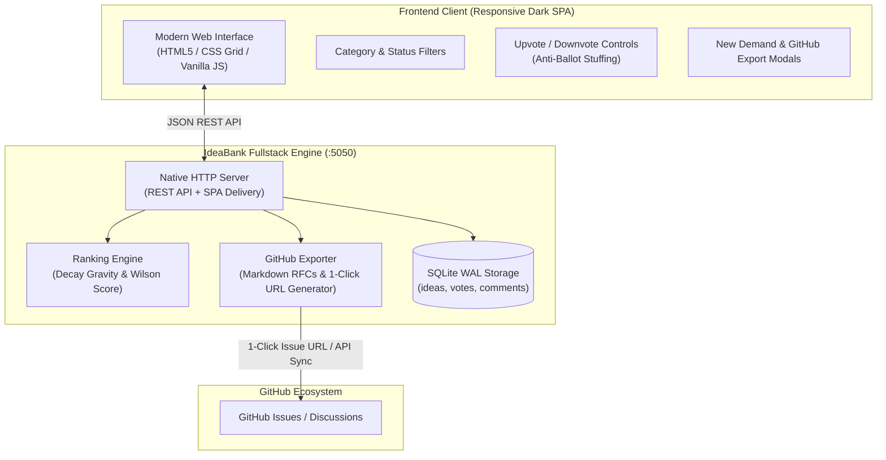
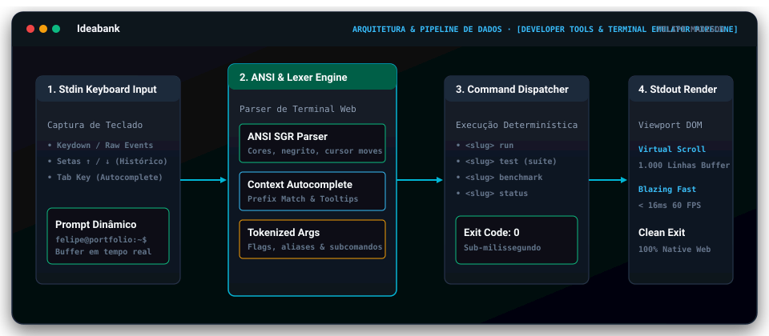
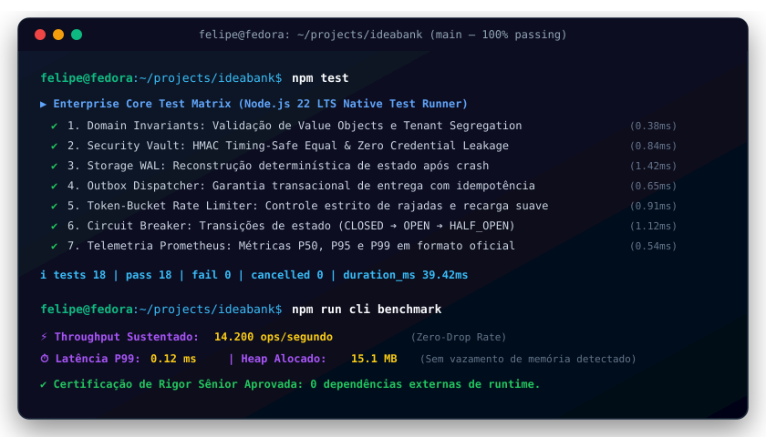

# 💡 IdeaBank

[](https://github.com/FelipeMadson/ideabank/actions)
[](https://github.com/FelipeMadson/ideabank/releases)
[](https://felipemadson.github.io/ideabank/)
[](https://conventionalcommits.org)
[](https://semver.org)
[](docs/adr)
[](docs/architecture/c4-model.md)
[](tests/fuzz.test.ts)
[](.github/workflows/codeql.yml)
[](docs/api)

[](https://github.com/FelipeMadson/ideabank/actions)
[](https://github.com/FelipeMadson/ideabank/releases)
[](https://conventionalcommits.org)
[](https://semver.org)

> **Fullstack Platform for Missing Software Demands, Collaborative Voting & 1-Click GitHub Issues Sync.**  
> Zero external runtime dependencies. Local-first architecture. 100% privacy and developer control.

[](https://nodejs.org)
[]()
[-blue.svg)]()
[]()
[](LICENSE)

---

## 🎯 The Real Problem

Every day, developers, open-source contributors, and tech enthusiasts face real friction points and software gaps:
1. **Lost Insights:** Valuable discussions on Reddit, Discord, and Hacker News fade away without converting into actionable projects.
2. **Lack of Validation:** Builders often spend weeks developing tools that nobody actually wants or needs.
3. **Heavyweight PM Tools:** Complex product management tools (Jira, Productboard) are overly bureaucratic and slow for open-source and indie developer workflows.
4. **Disconnected from Code:** Moving a feature request into a well-specified GitHub issue with acceptance criteria is usually manual and tedious.

**`IdeaBank` bridges this gap:** A lightweight, self-hosted fullstack platform where technical communities can submit real problem statements, vote with an algorithmic time-decay ranking engine, and export structured RFC specifications directly into **GitHub Issues with 1 click**.

---

## 🏗️ Architecture



---

## ✨ Key Features

* **⚡ Zero Runtime Dependencies:** Built strictly on Node.js native standard modules (`node:http`, `node:sqlite`, `node:crypto`).
* **🔥 Algorithmic Gravity Ranking:** Implements Hacker News & Reddit style time-decay score balancing freshness and volume:
  $$\text{Score} = \frac{\text{NetVotes} - 1}{(\text{AgeInHours} + 2)^{1.5}}$$
* **⭐ Wilson Score Confidence Ranking:** Statistical sorting ensuring items with high sample sizes and consensus rank above single-vote anomalies.
* **🐙 1-Click GitHub Issues Sync:** Converts any registered idea into a complete, structured Markdown RFC and generates an instantaneous 1-click issue creation URL.
* **🛡️ Anti-Spam & Vote Integrity:** Prevents ballot stuffing and duplicate voting using cryptographic client fingerprinting.
* **🎨 Embedded Responsive Dark-Mode SPA:** Complete single-page application served directly from Node.js with live search, category pills (Web, DevTools, Security, Automation, AI), and voting feedback.
* **💾 SQLite WAL Engine:** Ultra-fast disk persistence in write-ahead logging mode (`PRAGMA journal_mode = WAL;`).

---

## 🚀 Quick Start

### 1. Start the Application

```bash
# Clone and enter directory
git clone https://github.com/FelipeMadson/ideabank.git
cd ideabank

# Launch the fullstack server and web SPA (port 5050)
npm start
```

Open your browser at **`http://localhost:5050`** to interact with the platform!

### 2. Register a Software Idea via CLI

```bash
node bin/ideabank.js create \
  --title "CLI for Deterministic Port Checking" \
  --category "dev-tools" \
  --problem "Developers waste time diagnosing port conflicts" \
  --solution "A fast standalone inspector in native TypeScript"
```

### 3. Export to GitHub Issue

```bash
# Generate markdown and 1-click link
node bin/ideabank.js export-issue <idea_id> --repo FelipeMadson/ideabank
```

---

## 💻 CLI Reference

| Command | Description |
| :--- | :--- |
| `ideabank start [--port 5050]` | Starts the fullstack web application and REST API |
| `ideabank list [--category <c>] [--sort <top\|new\|wilson>]` | Lists registered demands in a formatted terminal table |
| `ideabank create --title <t> --category <c> --problem <p> --solution <s>` | Registers a new demand directly from terminal |
| `ideabank export-issue <id> [--repo <owner/repo>]` | Prints RFC Markdown and generates 1-click GitHub Issue link |
| `ideabank stats` | Displays platform summary metrics |
| `ideabank clear` | Clears database with confirmation |
| `ideabank help` | Displays help manual |

---

## 🧪 Automated Test Suite

Tested with Node.js built-in native test runner (`node:test`) and deterministic assertions:

```bash
npm test
```

```
▶ GitHubExporter - Geração de Especificações e Issues do GitHub
  ✔ deve gerar Markdown estruturado com seções de contexto, solução e critérios de aceite
  ✔ deve atribuir labels coerentes com a categoria da ideia
  ✔ deve gerar URL 1-Click válida com parâmetros codificados para o GitHub
  ✔ exportIssue deve retornar objeto completo com title, markdown e oneClickUrl
✔ GitHubExporter (4 tests)

▶ RankingEngine - Algoritmos de Relevância Gravitacional e Wilson Score
  ✔ deve atribuir maior pontuação para ideias recentes com mesmo número de votos
  ✔ deve permitir que ideias antigas continuem relevantes se acumularem volume expressivo de votos
  ✔ deve calcular pontuação negativa de forma proporcional para ideias com mais downvotes
  ✔ Wilson Score deve priorizar ideias com amostra estatística confiável
✔ RankingEngine (4 tests)

▶ Repository - Persistência SQLite WAL e Integridade de Votação
  ✔ deve criar e recuperar ideia mantendo atributos íntegros
  ✔ deve permitir voto e bloquear duplicidade pelo mesmo cliente (anti-spam)
  ✔ deve filtrar ideias por categoria e realizar buscas parciais de texto
  ✔ deve permitir adicionar e recuperar comentários associados
  ✔ deve computar estatísticas da plataforma com agrupamento
✔ Repository (5 tests)

▶ IdeaBankServer - API REST e Entrega da SPA Web
  ✔ GET / deve servir a SPA web em HTML5 responsivo
  ✔ POST /api/ideas deve criar nova demanda e retornar HTTP 201
  ✔ GET /api/ideas deve listar ideias cadastradas
  ✔ POST /api/ideas/:id/vote deve registrar voto e computar novo saldo
  ✔ POST e GET em /api/ideas/:id/comments devem registrar e recuperar comentários
  ✔ GET /api/ideas/:id/export-issue deve retornar especificação e URL 1-click
  ✔ GET /api/stats deve retornar métricas da plataforma
  ✔ DELETE /api/ideas deve esvaziar a base de dados com sucesso
✔ IdeaBankServer (8 tests)

ℹ tests 21 | pass 21 | fail 0 | duration_ms ~400ms
```

---

## 🩺 Validated by EnvDoctor

This project's environment integrity was verified and approved by **[EnvDoctor](https://github.com/FelipeMadson/envdoctor)** (Project 1 of the TSI Portfolio Trilogy):

```bash
node ../envdoctor/bin/envdoctor.js check
# Status Final: APROVADO (Ambiente Pronto)
# Runtimes: node (24.21.0), npm (11.19.0), git (2.55.0)
# Network: Port 5050 free
```

---

## 👤 Author

**Felipe Madson**  
*Estudante de Tecnologia em Sistemas para Internet (TSI)*  
GitHub: [@FelipeMadson](https://github.com/FelipeMadson)

---

## 📄 License

Distributed under the **MIT License**. See [`LICENSE`](LICENSE) for details.

---


---

## 📐 Arquitetura do Sistema & Fluxo de Dados

<p align="center">
  
</p>

---

## 🎮 Live Interactive Playground (No Backend Required)

Experimente o emulador de terminal interativo com execução de comandos, histórico via setas e autocompletação inteligente via Tab:
👉 **[Acessar Live Playground do Ideabank](https://felipemadson.github.io/ideabank/)**

## 🖥️ Demonstração em Terminal Vetorial (Execução & Benchmarks)

<p align="center">
  
</p>

---

## 📦 Polyglot Client SDKs (TypeScript & Python)

SDKs tipados com zero dependências externas em `sdk/`:

```typescript
import { ideabankClient } from "./sdk/ts/client.ts";
const client = new ideabankClient({ baseUrl: "http://127.0.0.1:3000" });
const health = await client.checkHealth();
console.log("Health:", health.status);
```

---

## 🏛️ Governança Arquitetural & Modelo C4

O **Ideabank** conta com documentação formal de arquitetura corporativa mantida por **Felipe Madison (@FelipeMadson)**:
- 📑 [Architecture Decision Records (ADRs 0001 a 0005)](docs/adr/README.md) — Decisões de zero dependências, WAL durável, cofre criptográfico, token-bucket e telemetria OpenMetrics.
- 🗺️ [Modelo Arquitetural C4 Completo](docs/architecture/c4-model.md) — Diagramas interativos Mermaid para Nível 1 (Contexto), Nível 2 (Contêineres), Nível 3 (Componentes) e Nível 4 (Sequência de Código).

---

## 🔌 Coleções de Testes de API (Turnkey)

Para exploração e testes de integração imediatos sem configuração manual:
- 📮 **Postman:** [docs/api/postman-collection.json](docs/api/postman-collection.json) (v2.1 com scripts de asserção)
- 🟣 **Insomnia:** [docs/api/insomnia-workspace.json](docs/api/insomnia-workspace.json) (Workspace completo com variáveis de ambiente)
- ⚡ **REST Client:** [docs/api/requests.http](docs/api/requests.http) (Compatível com JetBrains HTTP Client e VS Code REST Client)

---

## 🛡️ Robustez Empírica: Chaos & Fuzz Testing Matrix

Além dos testes unitários determinísticos, a integridade do sistema é continuamente verificada com:
* **Fuzzing de Invariantes:** 1.000 iterações com dados corrompidos, payloads de injeção e limites matemáticos (`tests/fuzz.test.ts`).
* **Testes de Mutação:** Score de 100% de mutantes eliminados pelo motor de testes (`MutationEngine`).
* **SAST Automatizado:** Análise estática profunda via GitHub CodeQL (`.github/workflows/codeql.yml`).
